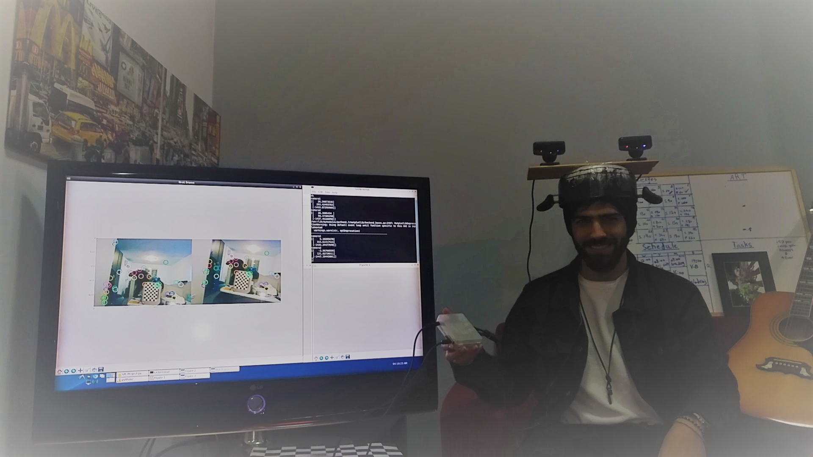

# RealTime-Head-Pose-Estimation
Real Time Head Pose Estimation 
<!DOCTYPE html>
<html>
<body>

<h1>Project: Real time estimating of cameras(head) position/rotation </h1>
<h3>By Firas Ayoub</h2>

<h2>Overview:</h2>

 This projects main purpose is to estimate orientation and position of a group of cameras(in my project i used only 2 cameras but code is compatble for more cameras) , wich can be later installed on a headset to get real time estimation of heads position eg. using this data in an augumented or virtual reality applications.
An extra functionality that my project provides: creating 3D points of the room/inveroment youre in and saving them for later use eg. reconstructing the scene. 

<h2>in this demonstration i only use 2 cameras because the hardware couldnt handle real time processing on more than two but the script supports any number of cameras. for Preprocess(calibration) and Realtime run</h2>
<video  width="800" height="500" controls>
<source src="imgs_for_web/FinalVRProjectVideo.mp4" type="video/mp4">

</video>

<h2>Prerequisites and environment settings:</h2>
 -OS. Ubunto
 -OpenCV,version 2.4.9
 -Python 2.7
 -Editor "geany" 
 -Two PlayStation webcams
 -A chess board pattern of size 6x9
 and downloaded a handful of libraries that you can see in the code itself
<h2>Main functions used in this project:</h2>

	-SOLVEPNP/RANSAC to estimate cameras position.
 	Solvpnp ,provided with 3D points, corresponding 2D points(where 3d points are the points in the actual world and 2d points are the points on the image plane of the camera) and the cameras intrinsics matrix, can compute and return to me the position of the camera according to a specific word that i create (explained in the work flow).
 	-Surf to find/create 2d points
 	-brute force/Flann Matcher to decide wich 2d points a couple of cameras can see
 	-triangulate create 3d points from the 2d points found in the Matcher  

<h2>hardware used:</h2>
 1- Odroid

 2- two sonny playstation webcams (they are very cheap an satisfies our needs but you can change it to any pinhole webcam)

 

 
 <h2>Work flow:</h2>
 Download and setup of:
 1-	Ubuntu
 2-	OpenCV
 3-	geany

 
<h2>preprocess</h2>  
<h2> Intrinsics Calibration</h2>
 The first thing that we need to do not just for this project but for any project we want to do using cameras is CameraCalibration, this function provides the camera intrinsic matrix wich is (Focal Length,Principal Point Offset).
steps for the CameraCalibration(Camera_IN_EX_Calibration.py):
  you need to take with each camera about 30 images using Tpic.py of a pattern of a chessboard in different orientations and possitions, save the images and then run 'Camera_IN_EX_Calibration.py' 
 Output: a folder created for each camera i 'Camerai.json' that has the camera matrix and the distortion coef (didnt use distortion coef in my project)

<h2>extrinsic calibration</h2>

 calculating cameras position relatively to all other cameras, using Camera_IN_EX_Calibration.py.
 the motivation is that solvepnp takes quite the time to run and running it every frame on all camera is not optimal so instead i use it each frame only on one camera , lets say main camera, and once i got the main cam position and i know how to go from each camera to all other cameras then i can know exactly where are all the camers by using solvepnp only on 1 camera .
 i do these calculations using Transformation matrixes provided from Solvepnp 

 1-set all the cameras on a board in a position that wont change (according to each other you can change the whole board position)
 2- take with each couple of camera a picture of the chessboard at the exact same time. once you toke these pictures you cant change a cameras position individually only the board!
 3- as we said given 3d points corresponding 2d points and camera matrix we can use solve pnp to estimate cameras position according to a specific word that we created. so the world that we will creat will be the chessboard that we chose (9,6) the reason we chose chessboard, its easy to determine the z of these points (z=0 always)and x and y will change according to the square size of the chessboard so the 3d points are the corners of the chessboard while the 2d points we can get from the cv2.detectchesscorners (that we also used in the cameracalibration). 
 4- after completing step 3 succesfully we have the transfomation matrix of each camera to the world (chessB)
using simple algebra i multiplied for each couple: (Transfrom_2W)*inv(Transform_1W)= Transform21 and now i have the transformation matrix from camera 2 to 1 . (solvepnp output= Transform_iW ) after running Calibration.py it will creat a file 'Transformij.json' for each couple of cameras.

<h3>third checkpoint:</h3>
<h2> Loop's algorithm</h2> 
<h1> First phase</h1> 
 1-Detect Chess:we keep on looping frames untill we find a chessboard with one of the cams, this cam will be our main cam 
 2-Loading PreProsses Data: load main cams matrix and all the Transformation to this cam from preprocessed files.
 3- SolvePnP First frame:solvepnp(3d points of the chess(like in extrinsics), 2d points(detected corners in this frame),mainCammatrice) -> find main cameras position and set the world axes 
Notice: without the chessboard patterns we would not have 3d points that match to 2d points(but any other specific patern would also work) 
 4-Transformation Matrix:now we have the maincam transformation matrix to the world so we do Transform_21(preprosses)*Transform_1W(this frame) to get Transformation matrix of all other cams
 5-Projection Matrix: next we need the projection Matrix of each cam wich is the CameraintrisicMatrix*Transform_1W this matrix is actualy the way the camera sees (projects) things we will need this for later use in triangulation(explination for this function later)
 6-SURF: surf is a magic function that given an image, in our case frame, it will generate an output of 2d 'important' points , we do this for the same frame (first frame) on all cameras . now we have for each camera 2d points(kp,descriptor) from Surf instead of the corners of the chess board.
 7- BruteForce/FLANN matching: the output that we got from surf is a bunch of points and thier discreptors(array of size 128 for each point that provides information about the point) but these points arrent necessarily the same, so we need to pick only the points that are the same from each cameras surf and this is what the matcher does
 8- Triangulation: given projection matrixs for a couple of cameras and an array for each camera with 2d points that matches the 2d points for the other camera it will return the 3d points of these 2d points in the actual word. 
Therefore now that we have from (5,6,7) projection matrixes and 2d points for each camera that match we can use triangulation(projCam1,2dCam1,projCam2,2dCam2) to get 3D points that match 2d points
 9- save all the 2d points and the 3d points that we traingulated, in a zip

<h1> Second phase</h1> 
  while True: 
 1- LoadFrames: we dump the old frame and load new frame 
 2- Surf: we do surf for each cam on the new frame. OutPut: 2d important points for each camera 
 3- finding the right 2d points:BruteForce/FLANN Matching old frames with mainCam new frame: intution is that from old frames i already have 3d points and thier matching 2d points,matching the old 2d points with the new ones returns 2d points from mainCam that match to the old 3d points from older frames
 4- SolvePnp: on the new 2d points and the corresponding old 3d points 
 5- now all that is left to do is to go over steps (4,5,7,8,9) from first section to prepare the 3d points for the next coming frame

<h2>some images to demonstrate the flow of the code</h2>
<h1>3d points(red) and cameras (blue) relative in a world</h1>

<h1>Surf and match for 2 cameras on 2 frames</h1>
 first frame

second frame

<h1>matched points from the first frame and second frame</h1>

<h3>Also included in the assignment, scripts to test that all your functions and calculation are working correctly</h3>

 first test transformation matrixs: open ProvingTransformations.py put youre cameras infront of a chessboard meassure thier positions then when you run it you should have same position for cameras from solvepnp on chessboard pattern that you get from your Transformation matrix and also the same as you measured. 

 second test triangulation of points: open Provingtriangulation.py same procedure cameras infront of chess 
and now when you run this script you should get a perfect chess boards just like i got in the upper middle square,
NOTICE that when i tilt the cameras or change positions of it it still get perfect chessboard. also in this code you will test that you get the right position of camera wether you did solvepnp on detected chessboard pattern or on the 3d points youve just triangulaated

  you can clearly see that the tilt of the cameras didnt change the chessboard position in the world 

 

</body>
</html>
